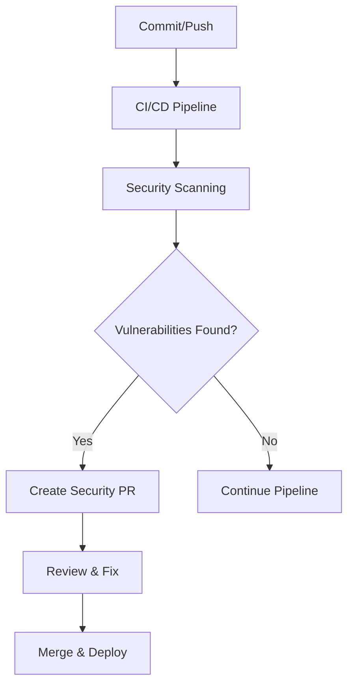
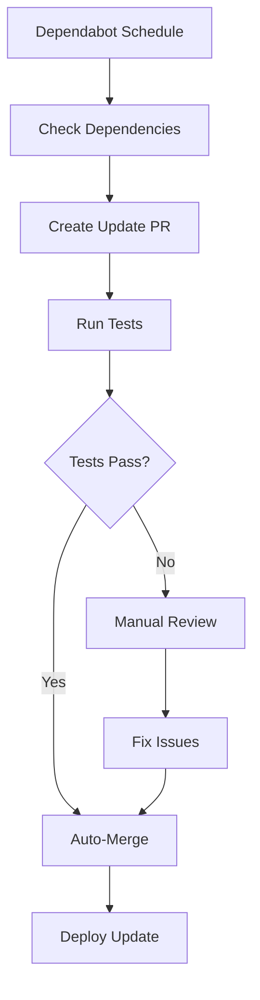

# 🔧 Gestión de Dependencias - Twenty One Pilots

## 📋 Visión General

Este documento describe el sistema automatizado de gestión de dependencias implementado para el proyecto Twenty One Pilots, enfocado en seguridad, estabilidad y mantenibilidad.

## 🎯 Objetivos

- ✅ **Seguridad**: Detección y corrección automática de vulnerabilidades
- ✅ **Estabilidad**: Actualizaciones controladas que no rompen funcionalidad
- ✅ **Transparencia**: Reportes claros sobre el estado de dependencias
- ✅ **Automatización**: Procesos que requieren mínima intervención manual

## 🏗️ Arquitectura del Sistema

### 1. Dependabot Configuration (`.github/dependabot.yml`)

#### Configuración por Ecosistema

```yaml
# Backend - Actualizaciones diarias
- package-ecosystem: "npm"
  directory: "/backend"
  schedule:
    interval: "daily"
    time: "06:00"
  groups:
    security-updates:
      applies-to: security-updates
    express-ecosystem:
      patterns: ["express", "express-*"]
```

#### Grupos de Dependencias

- **security-updates**: Parches y actualizaciones menores de seguridad
- **express-ecosystem**: Todas las dependencias relacionadas con Express
- **database-drivers**: Controladores de base de datos (MongoDB, Redis)
- **security-middleware**: Middleware de seguridad (Helmet, CORS, etc.)
- **react-ecosystem**: React y sus dependencias
- **ui-libraries**: Librerías de UI (Material-UI, Emotion)
- **build-tools**: Herramientas de construcción (Webpack, Babel, ESLint)

### 2. CI/CD Security Pipeline

#### Escaneos Automatizados

```yaml
# Snyk vulnerability scanning
- uses: snyk/actions/node@master
  with:
    args: --severity-threshold=medium

# OWASP Dependency Check
- uses: dependency-check/Dependency-Check_Action@main

# CodeQL Security Analysis
- uses: github/codeql-action/init@v2
```

#### Herramientas de Seguridad

- **Snyk**: Escaneo de vulnerabilidades en tiempo real
- **npm audit**: Análisis de dependencias con umbrales estrictos
- **OWASP Dependency Check**: Análisis estático de dependencias
- **CodeQL**: Análisis de código estático para vulnerabilidades
- **TruffleHog**: Detección de secrets en el código

### 3. Alertas y Monitoreo

#### Sistema de Alertas

```yaml
# Alertas automáticas para dependencias críticas
- Express updates
- Security vulnerabilities
- Outdated packages
- Bundle size increases
```

#### Reportes Diarios

- 📊 **Security Scan Reports**: Resultados de escaneos de seguridad
- 📦 **Dependency Reports**: Estado de todas las dependencias
- 🚨 **Critical Alerts**: Notificaciones de problemas críticos
- 📈 **Size Reports**: Monitoreo del tamaño de bundles

## 🔄 Flujo de Trabajo

### 1. Detección de Vulnerabilidades



### 2. Actualizaciones Automáticas



### 3. Proceso de Actualización

#### Para Dependencias Críticas

1. **Detección**: Dependabot identifica actualización disponible
2. **Validación**: CI/CD ejecuta tests completos
3. **Aprobación**: Revisión manual para cambios mayores
4. **Despliegue**: Actualización automática para parches de seguridad
5. **Monitoreo**: Verificación post-despliegue

#### Para Dependencias Normales

1. **Agrupación**: Dependabot agrupa actualizaciones relacionadas
2. **Testing**: Validación automática con tests
3. **Merge**: Auto-merge para actualizaciones menores
4. **Notificación**: Reportes de cambios aplicados

## 📊 Métricas y Reportes

### Dashboard de Dependencias

```json
{
  "security": {
    "vulnerabilities": 0,
    "critical": 0,
    "high": 0,
    "lastScan": "2025-01-20T06:00:00Z"
  },
  "updates": {
    "pending": 5,
    "applied": 23,
    "failed": 0
  },
  "bundle": {
    "size": "2.3MB",
    "change": "-0.1MB",
    "threshold": "3MB"
  }
}
```

### Reportes Automatizados

- **Daily Security Report**: Estado de vulnerabilidades
- **Weekly Dependency Report**: Actualizaciones aplicadas
- **Monthly Compliance Report**: Cumplimiento de políticas
- **Bundle Size Report**: Tendencias de tamaño

## 🛡️ Políticas de Seguridad

### Niveles de Severidad

- **🔴 Critical**: Requiere acción inmediata (≤24h)
- **🟠 High**: Revisión prioritaria (≤72h)
- **🟡 Medium**: Revisión programada (≤1 semana)
- **🟢 Low**: Monitoreo continuo

### Dependencias Prohibidas

```json
{
  "banned": [
    "left-pad",  // Ejemplo de paquete problemático
    "vulnerable-package@<1.2.3"
  ],
  "restricted": [
    "express@<4.18.0",
    "mongoose@<7.0.0"
  ]
}
```

### Versiones Soportadas

- **Node.js**: 18.x LTS (actual), 16.x LTS (mantenimiento)
- **npm**: ≥8.0.0
- **MongoDB**: 6.0+ (driver nativo)
- **Redis**: 7.x+

## 🚀 Mejores Prácticas

### Para Desarrolladores

1. **Revisar Dependabot PRs**: Siempre revisar cambios antes de merge
2. **Actualizar regularmente**: No acumular actualizaciones
3. **Probar localmente**: Validar cambios en desarrollo
4. **Documentar cambios**: Explicar actualizaciones significativas

### Para Mantenedores

1. **Monitorear alertas**: Responder rápidamente a vulnerabilidades
2. **Actualizar políticas**: Revisar configuraciones mensualmente
3. **Auditar dependencias**: Revisiones trimestrales completas
4. **Mantener documentación**: Actualizar guías según cambios

## 📞 Contactos y Soporte

- **Security Team**: security@twentyonepilots.com
- **DevOps Team**: devops@twentyonepilots.com
- **Documentation**: https://docs.twentyonepilots.com/dependencies

## 🔗 Enlaces Útiles

- [Dependabot Documentation](https://docs.github.com/en/code-security/dependabot)
- [Snyk Vulnerability Database](https://snyk.io/vuln/)
- [OWASP Dependency Check](https://owasp.org/www-project-dependency-check/)
- [npm Audit Documentation](https://docs.npmjs.com/cli/v8/commands/npm-audit)

---

**Última actualización**: $(date)
**Versión del documento**: 2.0.0
**Mantenedor**: DevOps Team