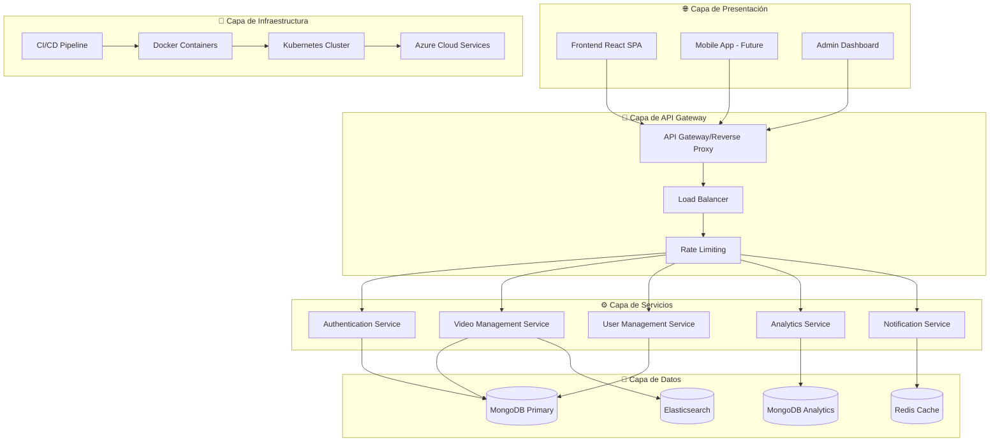
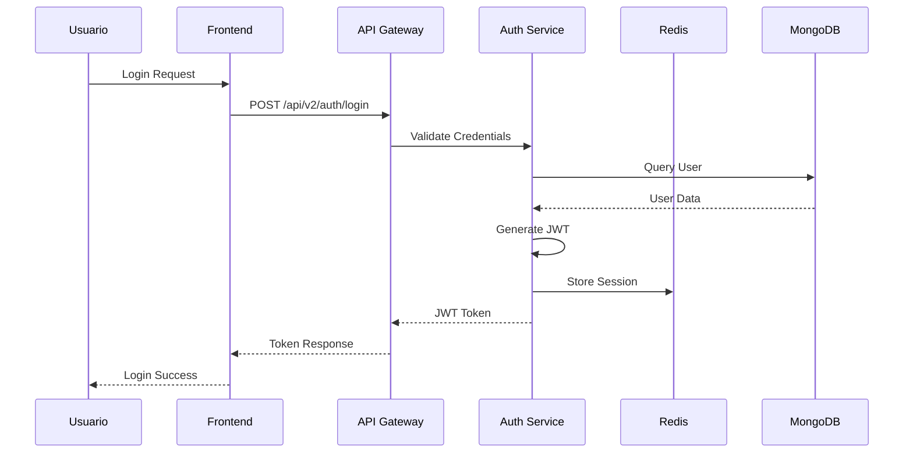
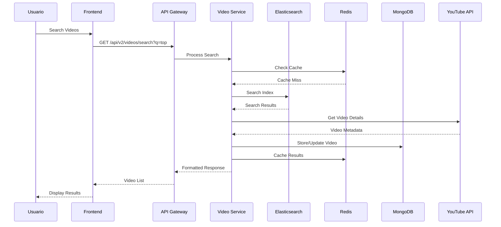
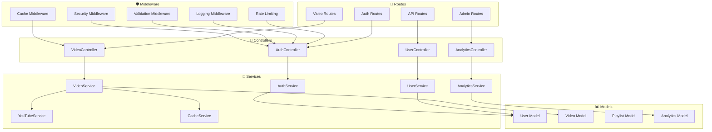
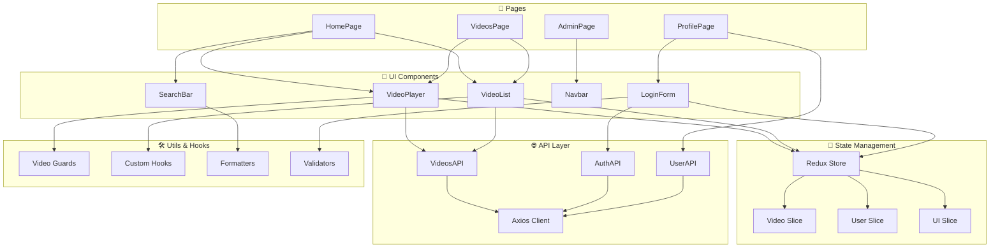
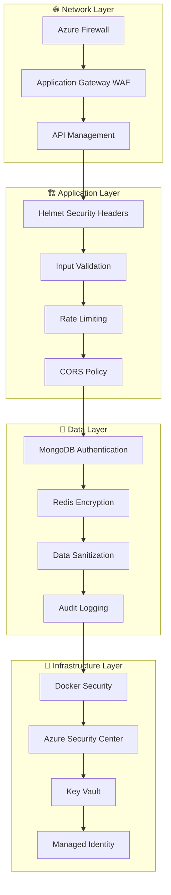
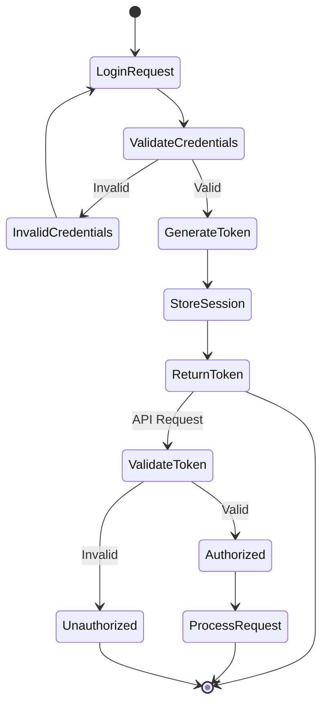
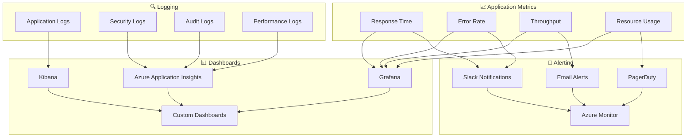
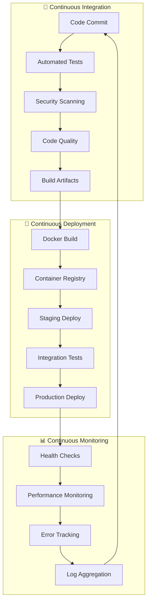
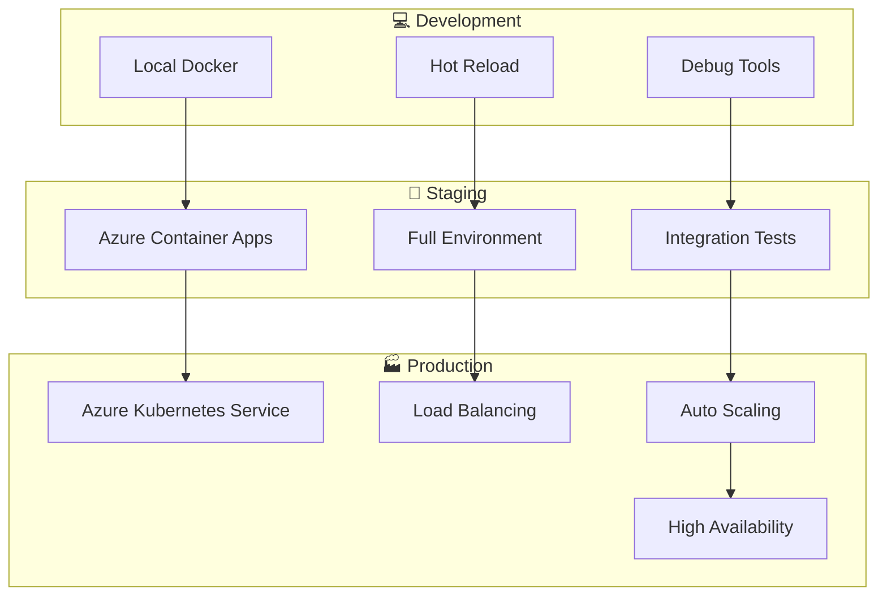

# 🏗️ Arquitectura del Sistema - Twenty One Pilots

## 📋 Visión General

La arquitectura del sistema Twenty One Pilots está diseñada para ser **escalable**, **segura** y **mantenible**, siguiendo las mejores prácticas de desarrollo moderno con microservicios, contenedorización y CI/CD automatizado.

## 🏛️ Arquitectura General



## 🔄 Flujo de Datos

### Autenticación y Autorización



### Gestión de Videos



## 🗂️ Estructura de Componentes

### Backend Architecture



### Frontend Architecture



## 🔐 Arquitectura de Seguridad

### Defense in Depth



### Autenticación JWT



## 📊 Arquitectura de Monitoreo

### Observabilidad Completa



## 🚀 Arquitectura de Despliegue

### CI/CD Pipeline



### Entornos de Despliegue



## 📋 Decisiones Arquitectónicas

### Tecnologías Elegidas

| Componente | Tecnología | Justificación |
|------------|------------|---------------|
| **Frontend** | React 18 | Componentes reutilizables, gran ecosistema |
| **Backend** | Node.js 18 | JavaScript full-stack, alto rendimiento |
| **Base de Datos** | MongoDB | Documentos JSON, escalabilidad horizontal |
| **Cache** | Redis | Alto rendimiento, estructuras de datos avanzadas |
| **Búsqueda** | Elasticsearch | Búsqueda full-text, analítica |
| **Contenedorización** | Docker | Portabilidad, aislamiento |
| **Orquestación** | Kubernetes | Escalabilidad automática, gestión |
| **Cloud** | Azure | Integración nativa, servicios gestionados |
| **CI/CD** | GitHub Actions | Integración con repositorio, gratuito |

### Patrones de Diseño

#### Backend Patterns
- **Repository Pattern**: Abstracción de acceso a datos
- **Service Layer**: Lógica de negocio separada
- **Middleware Chain**: Procesamiento de requests
- **Observer Pattern**: Eventos y notificaciones

#### Frontend Patterns
- **Container/Presentational**: Separación de lógica y UI
- **Higher-Order Components**: Reutilización de lógica
- **Custom Hooks**: Lógica compartida
- **Compound Components**: APIs flexibles

### Escalabilidad Considerations

#### Vertical Scaling
- ✅ Optimización de queries MongoDB
- ✅ Cache inteligente con Redis
- ✅ Compresión de respuestas
- ✅ CDN para assets estáticos

#### Horizontal Scaling
- ✅ Stateless application design
- ✅ Database sharding
- ✅ Load balancing
- ✅ Microservices architecture

## 🔧 Configuración y Despliegue

### Variables de Entorno

```bash
# Application
NODE_ENV=production
PORT=5000
API_VERSION=v2

# Database
MONGO_URI=mongodb://...
REDIS_URL=redis://...
ELASTICSEARCH_NODE=http://...

# Security
JWT_SECRET=...
YOUTUBE_API_KEY=...
AZURE_CLIENT_ID=...

# Monitoring
APPLICATIONINSIGHTS_CONNECTION_STRING=...
```

### Health Checks

```json
{
  "status": "healthy",
  "version": "2.0.0",
  "services": {
    "database": "connected",
    "redis": "connected",
    "elasticsearch": "connected"
  },
  "uptime": "99.9%",
  "response_time": "45ms"
}
```

## 📚 Referencias

- [Azure Architecture Center](https://docs.microsoft.com/en-us/azure/architecture/)
- [Node.js Best Practices](https://github.com/goldbergyoni/nodebestpractices)
- [React Best Practices](https://github.com/airbnb/javascript/tree/master/react)
- [MongoDB Architecture Guide](https://docs.mongodb.com/manual/core/architecture-guide/)
- [Elasticsearch Guide](https://www.elastic.co/guide/en/elasticsearch/reference/current/index.html)

---

**Última actualización**: $(date)
**Versión del documento**: 2.0.0
**Arquitecto**: DevOps Team