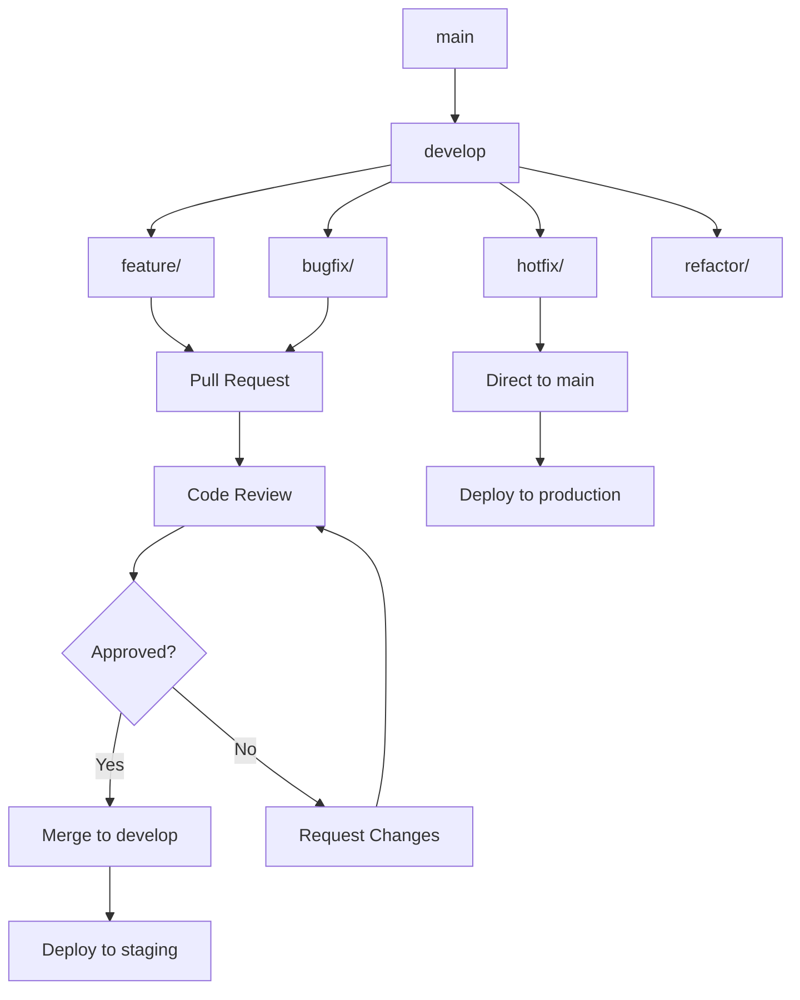

# 📏 Estándares de Código y Procesos - Twenty One Pilots

## 📋 Visión General

Esta guía establece los estándares de código y procesos de desarrollo para el proyecto Twenty One Pilots, asegurando consistencia, calidad y mantenibilidad en todo el codebase.

## 🎯 Principios Fundamentales

### Calidad del Código
- ✅ **Legibilidad**: Código fácil de entender y mantener
- ✅ **Consistencia**: Estándares uniformes en todo el proyecto
- ✅ **Eficiencia**: Optimización de recursos y performance
- ✅ **Seguridad**: Prácticas seguras desde el diseño

### Procesos de Desarrollo
- ✅ **Versionado**: Control de versiones claro y consistente
- ✅ **Testing**: Cobertura completa y automatizada
- ✅ **Revisión**: Code reviews obligatorios
- ✅ **Documentación**: Documentación actualizada y completa

## 📝 Estándares de JavaScript/Node.js

### Configuración ESLint

```javascript
// backend/.eslintrc.js
module.exports = {
  env: {
    node: true,
    es2022: true,
    jest: true
  },
  extends: [
    'eslint:recommended',
    '@typescript-eslint/recommended',
    'plugin:security/recommended',
    'plugin:node/recommended'
  ],
  plugins: ['security', '@typescript-eslint', 'node'],
  rules: {
    // Estándares del proyecto
    'no-console': process.env.NODE_ENV === 'production' ? 'error' : 'warn',
    'no-unused-vars': ['error', {
      argsIgnorePattern: '^_',
      varsIgnorePattern: '^_'
    }],
    'prefer-const': 'error',
    'no-var': 'error',

    // Seguridad
    'security/detect-eval-with-expression': 'error',
    'security/detect-non-literal-regexp': 'error',
    'security/detect-unsafe-regex': 'error',
    'security/detect-buffer-noassert': 'error',
    'security/detect-child-process': 'error',
    'security/detect-disable-mustache-escape': 'error',
    'security/detect-eval-with-expression': 'error',
    'security/detect-new-buffer': 'error',
    'security/detect-no-csrf-before-method-override': 'error',
    'security/detect-non-literal-fs-filename': 'error',
    'security/detect-object-injection': 'error',
    'security/detect-possible-timing-attacks': 'error',
    'security/detect-pseudoRandomBytes': 'error',

    // Node.js específico
    'node/no-deprecated-api': 'error',
    'node/no-extraneous-require': 'error',
    'node/no-missing-require': 'error',
    'node/no-unpublished-require': 'error',
    'node/process-exit-as-throw': 'error',
    'node/shebang': 'error'
  },
  parserOptions: {
    ecmaVersion: 2022,
    sourceType: 'module'
  }
};
```

### Estándares de Nomenclatura

#### Variables y Funciones
```javascript
// ✅ Correcto
const userData = {};
const isAuthenticated = false;
const getUserById = (id) => {};
const handleVideoSearch = async (query) => {};
const formatVideoDuration = (seconds) => {};

// ❌ Incorrecto
const user_data = {};           // snake_case
const isauthenticated = false;  // sin camelCase
const GetUserById = (id) => {}; // PascalCase para funciones
const handle_video_search = async (query) => {}; // snake_case
```

#### Clases y Constructores
```javascript
// ✅ Correcto
class VideoService {
  constructor() {
    this.apiKey = process.env.YOUTUBE_API_KEY;
  }

  async searchVideos(query) {
    // Implementation
  }

  async getVideoDetails(videoId) {
    // Implementation
  }
}

// ❌ Incorrecto
class video_service {           // snake_case
  constructor() {
    // Implementation
  }

  async SearchVideos(query) {   // PascalCase para métodos
    // Implementation
  }
}
```

#### Constantes
```javascript
// ✅ Correcto
const MAX_RETRY_ATTEMPTS = 3;
const API_BASE_URL = 'https://api.youtube.com/v3';
const JWT_SECRET_KEY = process.env.JWT_SECRET;
const DEFAULT_CACHE_TTL = 300000; // 5 minutes

// ❌ Incorrecto
const maxRetryAttempts = 3;     // camelCase para constantes
const apiBaseUrl = 'https://api.youtube.com/v3';
const jwt_secret_key = process.env.JWT_SECRET; // snake_case
```

### Estructura de Archivos

#### Backend Structure
```
backend/
├── src/
│   ├── controllers/
│   │   ├── userController.js
│   │   ├── videoController.js
│   │   └── authController.js
│   ├── models/
│   │   ├── User.js
│   │   ├── Video.js
│   │   └── Playlist.js
│   ├── services/
│   │   ├── userService.js
│   │   ├── videoService.js
│   │   └── authService.js
│   ├── middleware/
│   │   ├── auth.js
│   │   ├── validation.js
│   │   └── security.js
│   ├── routes/
│   │   ├── users.js
│   │   ├── videos.js
│   │   └── auth.js
│   ├── utils/
│   │   ├── logger.js
│   │   ├── helpers.js
│   │   └── constants.js
│   └── app.js
├── tests/
│   ├── unit/
│   ├── integration/
│   └── e2e/
└── docs/
```

#### Frontend Structure
```
frontend/
├── src/
│   ├── components/
│   │   ├── common/
│   │   ├── video/
│   │   ├── auth/
│   │   └── layout/
│   ├── pages/
│   │   ├── Home.js
│   │   ├── Videos.js
│   │   ├── Profile.js
│   │   └── Admin.js
│   ├── hooks/
│   │   ├── useAuth.js
│   │   ├── useVideos.js
│   │   └── useApi.js
│   ├── utils/
│   │   ├── api.js
│   │   ├── helpers.js
│   │   └── constants.js
│   ├── styles/
│   │   ├── global.css
│   │   ├── components.css
│   │   └── themes.css
│   ├── App.js
│   └── index.js
├── public/
└── tests/
```

## ⚛️ Estándares de React

### Configuración ESLint para React

```javascript
// frontend/.eslintrc.js
module.exports = {
  env: {
    browser: true,
    es2022: true,
    jest: true
  },
  extends: [
    'eslint:recommended',
    'plugin:react/recommended',
    'plugin:react-hooks/recommended',
    'plugin:jsx-a11y/recommended'
  ],
  plugins: ['react', 'react-hooks', 'jsx-a11y'],
  rules: {
    // React específico
    'react/prop-types': 'error',
    'react/jsx-uses-react': 'error',
    'react/jsx-uses-vars': 'error',
    'react/jsx-key': 'error',
    'react/jsx-no-duplicate-props': 'error',
    'react/jsx-no-undef': 'error',
    'react/jsx-pascal-case': 'error',
    'react/jsx-no-bind': ['error', {
      ignoreRefs: true,
      allowArrowFunctions: true,
      allowFunctions: true,
      allowBind: false
    }],

    // React Hooks
    'react-hooks/rules-of-hooks': 'error',
    'react-hooks/exhaustive-deps': 'warn',

    // JSX Accessibility
    'jsx-a11y/alt-text': 'error',
    'jsx-a11y/anchor-has-content': 'error',
    'jsx-a11y/anchor-is-valid': 'error',
    'jsx-a11y/click-events-have-key-events': 'error',
    'jsx-a11y/heading-has-content': 'error',
    'jsx-a11y/img-redundant-alt': 'error',
    'jsx-a11y/no-redundant-roles': 'error'
  },
  settings: {
    react: {
      version: 'detect'
    }
  }
};
```

### Componentes React

#### Componente Funcional con Hooks
```jsx
// ✅ Correcto
import React, { useState, useEffect, useCallback } from 'react';
import PropTypes from 'prop-types';

const VideoCard = ({ video, onSelect, className = '' }) => {
  const [isLoading, setIsLoading] = useState(false);
  const [error, setError] = useState(null);

  const handleClick = useCallback(async () => {
    if (!video?.id) return;

    setIsLoading(true);
    setError(null);

    try {
      await onSelect(video);
    } catch (err) {
      setError(err.message);
    } finally {
      setIsLoading(false);
    }
  }, [video, onSelect]);

  if (!video) {
    return <div className="video-card-skeleton" />;
  }

  return (
    <div
      className={`video-card ${className} ${isLoading ? 'loading' : ''}`}
      onClick={handleClick}
      role="button"
      tabIndex={0}
      onKeyPress={(e) => e.key === 'Enter' && handleClick()}
      aria-label={`Ver video: ${video.title}`}
    >
      
      <div className="video-info">
        <h3 className="video-title">{video.title}</h3>
        <p className="video-channel">{video.channelTitle}</p>
        {error && <p className="error-message">{error}</p>}
      </div>
      {isLoading && <div className="loading-spinner" />}
    </div>
  );
};

VideoCard.propTypes = {
  video: PropTypes.shape({
    id: PropTypes.string.isRequired,
    title: PropTypes.string.isRequired,
    thumbnail: PropTypes.string.isRequired,
    channelTitle: PropTypes.string.isRequired
  }),
  onSelect: PropTypes.func.isRequired,
  className: PropTypes.string
};

export default VideoCard;
```

#### Antipatrones a Evitar
```jsx
// ❌ Incorrecto - Componente de clase en React moderno
class VideoCard extends React.Component {
  constructor(props) {
    super(props);
    this.state = { isLoading: false };
  }

  handleClick = () => {
    this.setState({ isLoading: true });
    // Logic here
  }

  render() {
    return (
      <div onClick={this.handleClick}>
        {/* JSX */}
      </div>
    );
  }
}

// ❌ Incorrecto - Props sin validación
const VideoCard = ({ video, onSelect }) => {
  return <div onClick={() => onSelect(video)}>{video.title}</div>;
};

// ❌ Incorrecto - Inline functions en render
const VideoList = ({ videos, onVideoSelect }) => {
  return (
    <div>
      {videos.map(video => (
        <div key={video.id} onClick={() => onVideoSelect(video)}>
          {video.title}
        </div>
      ))}
    </div>
  );
};
```

### Custom Hooks

```jsx
// ✅ Correcto
import { useState, useEffect, useCallback } from 'react';
import { searchVideos as apiSearchVideos } from '../api/videos';

export const useVideoSearch = (initialQuery = '') => {
  const [query, setQuery] = useState(initialQuery);
  const [videos, setVideos] = useState([]);
  const [loading, setLoading] = useState(false);
  const [error, setError] = useState(null);
  const [page, setPage] = useState(1);
  const [hasNextPage, setHasNextPage] = useState(false);

  const searchVideos = useCallback(async (searchQuery, pageNum = 1) => {
    if (!searchQuery?.trim()) return;

    setLoading(true);
    setError(null);

    try {
      const result = await apiSearchVideos(searchQuery, {
        limit: 20,
        page: pageNum
      });

      if (result.success) {
        if (pageNum === 1) {
          setVideos(result.data);
        } else {
          setVideos(prev => [...prev, ...result.data]);
        }
        setHasNextPage(result.pagination?.hasNextPage || false);
        setPage(pageNum);
      } else {
        setError(result.error);
      }
    } catch (err) {
      setError(err.message);
    } finally {
      setLoading(false);
    }
  }, []);

  const loadMore = useCallback(() => {
    if (!loading && hasNextPage) {
      searchVideos(query, page + 1);
    }
  }, [loading, hasNextPage, query, page, searchVideos]);

  const reset = useCallback(() => {
    setVideos([]);
    setPage(1);
    setHasNextPage(false);
    setError(null);
  }, []);

  // Efecto para búsqueda inicial
  useEffect(() => {
    if (initialQuery) {
      searchVideos(initialQuery);
    }
  }, [initialQuery, searchVideos]);

  return {
    query,
    setQuery,
    videos,
    loading,
    error,
    hasNextPage,
    searchVideos,
    loadMore,
    reset
  };
};
```

## 🧪 Estándares de Testing

### Configuración Jest

```javascript
// backend/jest.config.js
module.exports = {
  testEnvironment: 'node',
  testMatch: [
    '<rootDir>/tests/**/*.test.js',
    '<rootDir>/src/**/*.test.js'
  ],
  collectCoverageFrom: [
    'src/**/*.js',
    '!src/**/*.test.js',
    '!src/**/index.js'
  ],
  coverageThreshold: {
    global: {
      branches: 80,
      functions: 80,
      lines: 80,
      statements: 80
    }
  },
  setupFilesAfterEnv: ['<rootDir>/tests/setup.js'],
  testTimeout: 10000,
  verbose: true,
  forceExit: true,
  detectOpenHandles: true
};
```

### Estructura de Tests

#### Test Unitario
```javascript
// src/services/videoService.test.js
const videoService = require('../videoService');
const youtubeService = require('../youtubeService');

// Mock dependencies
jest.mock('../youtubeService');

describe('VideoService', () => {
  beforeEach(() => {
    jest.clearAllMocks();
  });

  describe('searchVideos', () => {
    it('should return formatted video data on successful search', async () => {
      // Arrange
      const mockQuery = 'Twenty One Pilots';
      const mockYoutubeResponse = {
        success: true,
        data: [{
          id: 'video123',
          title: 'Stressed Out',
          channelTitle: 'Fueled By Ramen'
        }]
      };

      youtubeService.searchVideos.mockResolvedValue(mockYoutubeResponse);

      // Act
      const result = await videoService.searchVideos(mockQuery);

      // Assert
      expect(result.success).toBe(true);
      expect(result.data).toHaveLength(1);
      expect(result.data[0]).toMatchObject({
        id: 'video123',
        title: 'Stressed Out',
        channelTitle: 'Fueled By Ramen'
      });
      expect(youtubeService.searchVideos).toHaveBeenCalledWith(mockQuery, expect.any(Object));
    });

    it('should handle YouTube API errors gracefully', async () => {
      // Arrange
      const mockError = new Error('YouTube API unavailable');
      youtubeService.searchVideos.mockRejectedValue(mockError);

      // Act & Assert
      await expect(videoService.searchVideos('test query'))
        .rejects
        .toThrow('YouTube API unavailable');
    });

    it('should validate input parameters', async () => {
      // Act & Assert
      await expect(videoService.searchVideos('')).rejects.toThrow('Query is required');
      await expect(videoService.searchVideos(null)).rejects.toThrow('Query is required');
    });
  });

  describe('getVideoDetails', () => {
    it('should return detailed video information', async () => {
      // Test implementation
    });

    it('should cache video details', async () => {
      // Test implementation
    });
  });
});
```

#### Test de Integración
```javascript
// tests/integration/video-api.test.js
const request = require('supertest');
const app = require('../../src/app');
const { connectDB, disconnectDB } = require('../../src/utils/database');

describe('Video API Integration', () => {
  beforeAll(async () => {
    await connectDB();
  });

  afterAll(async () => {
    await disconnectDB();
  });

  beforeEach(async () => {
    // Clean up test data
    await Video.deleteMany({});
  });

  describe('GET /api/v2/videos/search', () => {
    it('should return videos for valid search query', async () => {
      const response = await request(app)
        .get('/api/v2/videos/search')
        .query({ q: 'Twenty One Pilots', limit: 5 })
        .expect(200);

      expect(response.body.success).toBe(true);
      expect(Array.isArray(response.body.data)).toBe(true);
      expect(response.body.data.length).toBeLessThanOrEqual(5);

      if (response.body.data.length > 0) {
        const video = response.body.data[0];
        expect(video).toHaveProperty('id');
        expect(video).toHaveProperty('title');
        expect(video).toHaveProperty('channelTitle');
      }
    });

    it('should handle empty search query', async () => {
      const response = await request(app)
        .get('/api/v2/videos/search')
        .query({ q: '' })
        .expect(400);

      expect(response.body.success).toBe(false);
      expect(response.body.message).toMatch(/query.*required/i);
    });

    it('should respect pagination parameters', async () => {
      const response = await request(app)
        .get('/api/v2/videos/search')
        .query({ q: 'test', limit: 2, page: 1 })
        .expect(200);

      expect(response.body.data.length).toBeLessThanOrEqual(2);
      expect(response.body.pagination).toBeDefined();
    });
  });

  describe('GET /api/v2/videos/:id', () => {
    it('should return video details for valid ID', async () => {
      const validVideoId = 'dQw4w9WgXcQ'; // Rick Roll video ID

      const response = await request(app)
        .get(`/api/v2/videos/${validVideoId}`)
        .expect(200);

      expect(response.body.success).toBe(true);
      expect(response.body.data).toHaveProperty('id', validVideoId);
      expect(response.body.data).toHaveProperty('title');
    });

    it('should return 404 for invalid video ID', async () => {
      const response = await request(app)
        .get('/api/v2/videos/invalid-id')
        .expect(404);

      expect(response.body.success).toBe(false);
      expect(response.body.message).toMatch(/not found/i);
    });
  });
});
```

#### Test E2E
```javascript
// tests/e2e/video-workflow.test.js
const puppeteer = require('puppeteer');

describe('Video Search E2E', () => {
  let browser;
  let page;

  beforeAll(async () => {
    browser = await puppeteer.launch();
  });

  afterAll(async () => {
    await browser.close();
  });

  beforeEach(async () => {
    page = await browser.newPage();
    await page.goto('http://localhost:3000');
  });

  afterEach(async () => {
    await page.close();
  });

  it('should load the home page', async () => {
    await expect(page.title()).resolves.toMatch(/Twenty One Pilots/);
  });

  it('should search for videos', async () => {
    // Wait for search input
    await page.waitForSelector('input[placeholder*="buscar"]');

    // Type search query
    await page.type('input[placeholder*="buscar"]', 'Twenty One Pilots');

    // Click search button
    await page.click('button[type="submit"]');

    // Wait for results
    await page.waitForSelector('.video-card', { timeout: 10000 });

    // Check that results are displayed
    const videoCards = await page.$$('.video-card');
    expect(videoCards.length).toBeGreaterThan(0);

    // Check first video has required elements
    const firstVideo = videoCards[0];
    const title = await firstVideo.$eval('.video-title', el => el.textContent);
    const channel = await firstVideo.$eval('.video-channel', el => el.textContent);

    expect(title).toBeTruthy();
    expect(channel).toBeTruthy();
  });

  it('should handle video selection', async () => {
    // Search for videos first
    await page.waitForSelector('input[placeholder*="buscar"]');
    await page.type('input[placeholder*="buscar"]', 'Twenty One Pilots');
    await page.click('button[type="submit"]');

    // Wait for and click first video
    await page.waitForSelector('.video-card');
    await page.click('.video-card:first-child');

    // Check that video player is displayed
    await page.waitForSelector('.video-player', { timeout: 5000 });
    const player = await page.$('.video-player');
    expect(player).toBeTruthy();
  });
});
```

## 📋 Procesos de Desarrollo

### Git Flow



### Commits Convencionales

```bash
# Formato: type(scope): description [flags]

# ✅ Tipos válidos
feat(auth): add JWT authentication
fix(video): resolve player loading issue
docs(api): update endpoint documentation
style(components): format video card component
refactor(services): optimize API calls
test(auth): add login integration tests
chore(deps): update development dependencies

# ✅ Scopes válidos
feat(auth): new authentication feature
feat(video): video player improvements
fix(api): API response format fix
docs(readme): update installation guide

# ✅ Flags opcionales
feat(auth): add JWT authentication [BREAKING]
fix(video): resolve player loading issue [HOTFIX]
```

### Pull Request Template

```markdown
## 📝 Descripción
[Breve descripción de los cambios realizados]

## 🎯 Tipo de Cambio
- [ ] 🐛 **Bug fix** (corrección de error)
- [ ] ✨ **New feature** (nueva funcionalidad)
- [ ] 📚 **Documentation** (cambios en documentación)
- [ ] 🎨 **UI/UX** (mejoras visuales)
- [ ] ⚡ **Performance** (optimizaciones)
- [ ] 🔒 **Security** (mejoras de seguridad)
- [ ] 🧪 **Tests** (pruebas)
- [ ] 🔧 **Refactor** (reorganización de código)
- [ ] 📦 **Dependencies** (actualización de dependencias)

## 🔍 Cambios Realizados
### Backend
- [ ] Controllers modificados
- [ ] Models actualizados
- [ ] Services refactorizados
- [ ] Middleware agregado/modificado

### Frontend
- [ ] Componentes nuevos/modificados
- [ ] Hooks actualizados
- [ ] Estilos modificados
- [ ] Utilidades agregadas

### Base de Datos
- [ ] Esquemas modificados
- [ ] Migraciones necesarias
- [ ] Seeds actualizados

## 🧪 Testing
- [ ] Tests unitarios pasan ✅
- [ ] Tests de integración pasan ✅
- [ ] Tests E2E pasan ✅
- [ ] Linting pasa ✅
- [ ] Security scan pasa ✅
- [ ] Coverage > 80% ✅

## 📋 Checklist
- [ ] Mi código sigue los estándares del proyecto
- [ ] He agregado tests para mis cambios
- [ ] He actualizado la documentación necesaria
- [ ] He probado los cambios localmente
- [ ] Los commits siguen el formato convencional
- [ ] He revisado que no hay código duplicado
- [ ] He considerado el impacto en performance

## 🔗 Issues Relacionados
- Closes #123
- Relates to #456
- Part of epic #789

## 🚀 Notas de Despliegue
[Cualquier instrucción especial para despliegue]

## 📸 Screenshots (si aplica)
[Imágenes de cambios visuales]

## ⚠️ Breaking Changes
[Listar cambios que rompen compatibilidad]

## 🔍 Additional Notes
[Cualquier información adicional relevante]
```

### Code Review Checklist

#### Para el Revisor
```markdown
## ✅ Code Review Checklist

### Arquitectura & Diseño
- [ ] El código sigue los principios SOLID
- [ ] La arquitectura es escalable y mantenible
- [ ] No hay acoplamiento innecesario
- [ ] Las responsabilidades están bien separadas

### Código & Estilo
- [ ] Sigue las convenciones de nomenclatura
- [ ] No hay código duplicado
- [ ] Las funciones son pequeñas y enfocadas
- [ ] El código es legible y auto-documentado

### Funcionalidad
- [ ] La funcionalidad cumple con los requisitos
- [ ] Manejo adecuado de errores
- [ ] Validación de inputs
- [ ] Casos edge están cubiertos

### Testing
- [ ] Tests cubren la nueva funcionalidad
- [ ] Tests pasan en CI/CD
- [ ] Cobertura de código adecuada
- [ ] Tests son independientes y rápidos

### Seguridad
- [ ] No hay vulnerabilidades conocidas
- [ ] Datos sensibles están protegidos
- [ ] Autenticación/autorización correcta
- [ ] Validación de inputs robusta

### Performance
- [ ] No hay regresiones de performance
- [ ] Consultas a BD optimizadas
- [ ] Uso eficiente de memoria
- [ ] Carga de página aceptable

### Documentación
- [ ] README actualizado si es necesario
- [ ] Comentarios en código complejo
- [ ] Documentación de API actualizada
- [ ] Cambios breaking documentados
```

## 🔧 Herramientas de Calidad

### Pre-commit Hooks

```bash
# .husky/pre-commit
#!/bin/sh
. "$(dirname "$0")/_/husky.sh"

# Run linting
npm run lint

# Run tests
npm run test:unit

# Check for secrets
npx git-secrets --scan

# Check commit message format
npx commitlint --edit $1
```

### Commitlint Configuration

```javascript
// commitlint.config.js
module.exports = {
  extends: ['@commitlint/config-conventional'],
  rules: {
    'type-enum': [
      2,
      'always',
      [
        'build',
        'chore',
        'ci',
        'docs',
        'feat',
        'fix',
        'perf',
        'refactor',
        'revert',
        'style',
        'test'
      ]
    ],
    'scope-case': [2, 'always', 'lower-case'],
    'subject-case': [2, 'always', 'lower-case'],
    'subject-empty': [2, 'never'],
    'subject-full-stop': [2, 'never', '.'],
    'header-max-length': [2, 'always', 72],
    'scope-empty': [0, 'never']
  }
};
```

### Semantic Versioning

```javascript
// version.config.js
module.exports = {
  types: [
    { type: 'feat', section: 'Features', hidden: false },
    { type: 'fix', section: 'Bug Fixes', hidden: false },
    { type: 'chore', section: 'Chores', hidden: false },
    { type: 'docs', section: 'Documentation', hidden: false },
    { type: 'style', section: 'Styles', hidden: false },
    { type: 'refactor', section: 'Code Refactoring', hidden: false },
    { type: 'perf', section: 'Performance Improvements', hidden: false },
    { type: 'test', section: 'Tests', hidden: false },
    { type: 'build', section: 'Build System', hidden: false },
    { type: 'ci', section: 'Continuous Integration', hidden: false }
  ]
};
```

## 📊 Métricas de Calidad

### Code Coverage

```javascript
// jest.config.js - Coverage configuration
module.exports = {
  collectCoverageFrom: [
    'src/**/*.{js,jsx}',
    '!src/**/*.test.{js,jsx}',
    '!src/**/index.js',
    '!src/**/*.stories.{js,jsx}'
  ],
  coverageThreshold: {
    global: {
      branches: 80,
      functions: 80,
      lines: 80,
      statements: 80
    },
    './src/components/': {
      branches: 90,
      functions: 90,
      lines: 90,
      statements: 90
    }
  },
  coverageReporters: [
    'text',
    'lcov',
    'html',
    'json-summary'
  ]
};
```

### Performance Budgets

```javascript
// webpack.config.js - Performance budgets
module.exports = {
  performance: {
    hints: 'warning',
    maxEntrypointSize: 512000, // 500KB
    maxAssetSize: 1024000,     // 1MB
    assetFilter: function(assetFilename) {
      return assetFilename.endsWith('.js');
    }
  }
};
```

### Complexity Limits

```javascript
// .eslintrc.js - Complexity rules
module.exports = {
  rules: {
    'complexity': ['error', 10],           // Max cyclomatic complexity
    'max-depth': ['error', 4],             // Max nesting depth
    'max-lines': ['error', 300],           // Max lines per file
    'max-lines-per-function': ['error', 50], // Max lines per function
    'max-params': ['error', 4],            // Max parameters per function
    'max-statements': ['error', 20]        // Max statements per function
  }
};
```

## 🎯 Mejores Prácticas

### Principios SOLID

```javascript
// ✅ Single Responsibility Principle
class VideoService {
  constructor(youtubeAPI, cache) {
    this.youtubeAPI = youtubeAPI;
    this.cache = cache;
  }

  async searchVideos(query) {
    // Solo responsabilidad: buscar videos
  }

  async getVideoDetails(videoId) {
    // Solo responsabilidad: obtener detalles
  }
}

// ❌ Violación SRP
class VideoManager {
  async searchAndCacheAndNotify(query) {
    // Múltiples responsabilidades mezcladas
  }
}
```

### Error Handling

```javascript
// ✅ Centralized error handling
class APIError extends Error {
  constructor(message, statusCode, code) {
    super(message);
    this.statusCode = statusCode;
    this.code = code;
    this.name = 'APIError';
  }
}

const handleAPIError = (error) => {
  if (error instanceof APIError) {
    return {
      success: false,
      error: error.message,
      code: error.code
    };
  }

  // Log unexpected errors
  logger.error('Unexpected error:', error);

  return {
    success: false,
    error: 'Internal server error'
  };
};
```

### Logging Standards

```javascript
// ✅ Structured logging
const logger = winston.createLogger({
  level: process.env.LOG_LEVEL || 'info',
  format: winston.format.combine(
    winston.format.timestamp(),
    winston.format.errors({ stack: true }),
    winston.format.json()
  ),
  defaultMeta: { service: 'twentyonepilots-api' },
  transports: [
    new winston.transports.File({ filename: 'logs/error.log', level: 'error' }),
    new winston.transports.File({ filename: 'logs/combined.log' })
  ]
});

// Usage
logger.info('Video search completed', {
  query,
  resultsCount: results.length,
  duration: Date.now() - startTime,
  userId: req.user?.id
});

logger.error('Database connection failed', {
  error: error.message,
  stack: error.stack,
  connectionString: sanitizedConnectionString
});
```

## 📚 Referencias

### Estándares Externos
- [Airbnb JavaScript Style Guide](https://github.com/airbnb/javascript)
- [Google JavaScript Style Guide](https://google.github.io/styleguide/jsguide.html)
- [React Best Practices](https://github.com/airbnb/javascript/tree/master/react)
- [Node.js Best Practices](https://github.com/goldbergyoni/nodebestpractices)

### Herramientas
- [ESLint](https://eslint.org/docs/rules/)
- [Prettier](https://prettier.io/docs/en/options.html)
- [Jest](https://jestjs.io/docs/getting-started)
- [Testing Library](https://testing-library.com/docs/)

---

**Última actualización**: $(date)
**Versión del documento**: 2.0.0
**Mantenedor**: DevOps Team