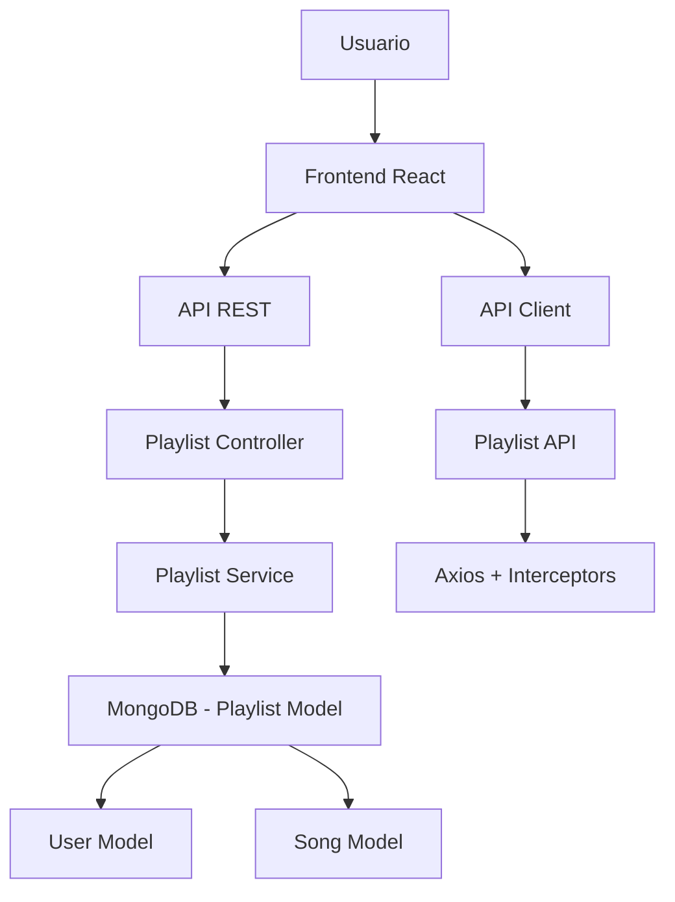
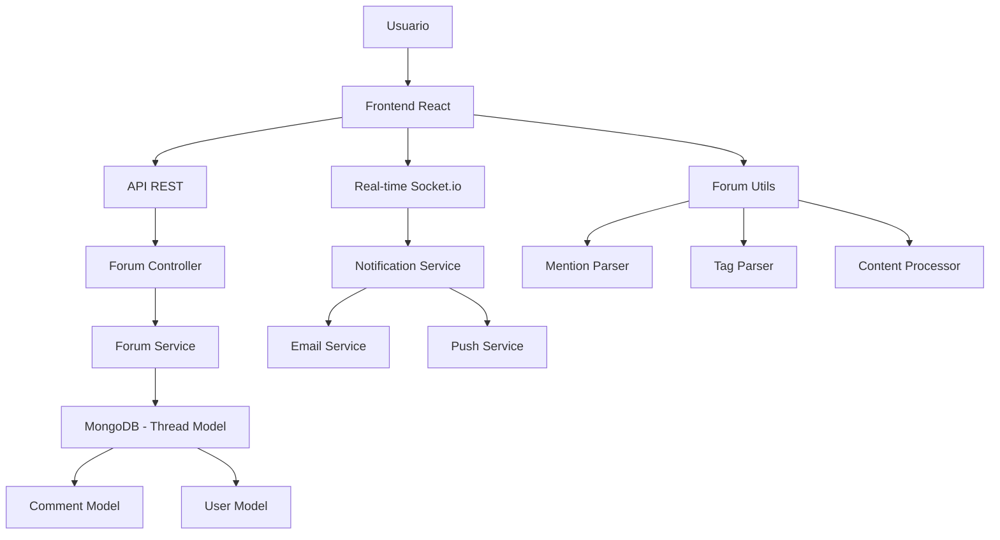

# 🎵 Sistema de Playlists Personalizadas y Foro Interactivo - Twenty One Pilots

## 📋 Visión General

Este documento describe la implementación completa de dos sistemas críticos para la experiencia de usuario en la aplicación Twenty One Pilots: **Playlists Personalizadas** y **Foro Interactivo con Menciones y Etiquetas**. Estos sistemas permiten a los usuarios crear contenido personalizado y participar en una comunidad activa.

## 🎵 Sistema de Playlists Personalizadas

### ✅ Estado: COMPLETADO

El sistema de playlists permite a los usuarios crear, gestionar y compartir colecciones personalizadas de canciones de Twenty One Pilots.

### 🏗️ Arquitectura



### 📊 Modelo de Datos

#### Playlist Schema
```javascript
{
  _id: ObjectId,
  name: { type: String, required: true, maxlength: 100 },
  description: { type: String, maxlength: 500 },
  userId: { type: ObjectId, ref: 'User', required: true },
  songs: [{
    songId: { type: ObjectId, ref: 'Song' },
    addedAt: { type: Date, default: Date.now },
    order: { type: Number, default: 0 }
  }],
  isPublic: { type: Boolean, default: false },
  tags: [{ type: String }],
  createdAt: { type: Date, default: Date.now },
  updatedAt: { type: Date, default: Date.now },
  playCount: { type: Number, default: 0 },
  likeCount: { type: Number, default: 0 }
}
```

### 🔧 API Endpoints

#### Gestión de Playlists
```http
GET    /api/playlists/user/:userId     # Obtener playlists del usuario
GET    /api/playlists/:id              # Obtener playlist específica
POST   /api/playlists                  # Crear nueva playlist
PUT    /api/playlists/:id              # Actualizar playlist
DELETE /api/playlists/:id              # Eliminar playlist
```

#### Gestión de Canciones
```http
POST   /api/playlists/:id/songs        # Agregar canción
DELETE /api/playlists/:id/songs/:songId # Eliminar canción
PUT    /api/playlists/:id/reorder      # Reordenar canciones
```

#### Interacciones Sociales
```http
POST   /api/playlists/:id/like         # Dar like a playlist
POST   /api/playlists/:id/share        # Compartir playlist
GET    /api/playlists/public           # Obtener playlists públicas
```

### 🎨 Interfaz de Usuario

#### Página de Playlists
- **Vista de cuadrícula** con miniaturas de playlists
- **Filtros avanzados** por nombre, etiquetas, popularidad
- **Búsqueda en tiempo real** con debounce
- **Modo creación/edición** con drag & drop

#### Componentes Principales
```jsx
// PlaylistsPage.jsx
<PlaylistsGrid playlists={playlists} />
<PlaylistFilters onFilter={handleFilter} />
<CreatePlaylistModal />

// PlaylistCard.jsx
<PlaylistThumbnail />
<PlaylistInfo name={name} songCount={songs.length} />
<PlaylistActions onEdit={handleEdit} onDelete={handleDelete} />
```

### 🔒 Seguridad Implementada

#### Validaciones
- **Autenticación requerida** para todas las operaciones
- **Propiedad de playlist** verificada antes de modificaciones
- **Límite de playlists** por usuario (máximo 50)
- **Validación de contenido** XSS y sanitización

#### Rate Limiting
```javascript
// Rate limiting específico para playlists
const playlistLimiter = rateLimit({
  windowMs: 15 * 60 * 1000, // 15 minutos
  max: 30, // máximo 30 operaciones por ventana
  message: 'Demasiadas operaciones de playlist'
});
```

### 📊 Características Avanzadas

#### Reordenamiento por Drag & Drop
```javascript
const handleReorder = async (playlistId, newOrder) => {
  try {
    await playlistAPI.reorderSongs(playlistId, newOrder);
    updateLocalState(newOrder);
    showSuccessToast('Playlist reordenada');
  } catch (error) {
    showErrorToast('Error al reordenar');
  }
};
```

#### Compartir Playlists
```javascript
const sharePlaylist = async (playlistId) => {
  const shareUrl = `${window.location.origin}/playlists/${playlistId}`;
  await navigator.clipboard.writeText(shareUrl);
  showSuccessToast('Enlace copiado al portapapeles');
};
```

#### Estadísticas de Uso
- **Reproducciones totales** por playlist
- **Likes y compartidos** sociales
- **Popularidad** basada en interacciones
- **Tendencias** semanales/mensuales

## 🗣️ Sistema de Foro Interactivo

### ✅ Estado: COMPLETADO

El foro permite a los fans de Twenty One Pilots crear hilos de discusión, comentar y participar en una comunidad activa con sistema de menciones y etiquetas.

### 🏗️ Arquitectura del Foro



### 📊 Modelos de Datos del Foro

#### Thread Schema
```javascript
{
  _id: ObjectId,
  title: { type: String, required: true, maxlength: 200 },
  content: { type: String, required: true },
  authorId: { type: ObjectId, ref: 'User', required: true },
  category: {
    type: String,
    enum: ['general', 'music', 'concerts', 'merchandise', 'fan-art', 'questions', 'announcements'],
    default: 'general'
  },
  tags: [{ type: String }],
  mentions: [{ type: ObjectId, ref: 'User' }],
  isPinned: { type: Boolean, default: false },
  isLocked: { type: Boolean, default: false },
  viewCount: { type: Number, default: 0 },
  likeCount: { type: Number, default: 0 },
  commentCount: { type: Number, default: 0 },
  createdAt: { type: Date, default: Date.now },
  updatedAt: { type: Date, default: Date.now }
}
```

#### Comment Schema
```javascript
{
  _id: ObjectId,
  threadId: { type: ObjectId, ref: 'Thread', required: true },
  content: { type: String, required: true },
  authorId: { type: ObjectId, ref: 'User', required: true },
  parentId: { type: ObjectId, ref: 'Comment' }, // Para respuestas anidadas
  mentions: [{ type: ObjectId, ref: 'User' }],
  tags: [{ type: String }],
  likeCount: { type: Number, default: 0 },
  isEdited: { type: Boolean, default: false },
  createdAt: { type: Date, default: Date.now },
  updatedAt: { type: Date, default: Date.now }
}
```

### 🎯 Sistema de Menciones (@username)

#### Funcionalidades
- **Detección automática** de @username en contenido
- **Validación de usuarios** existentes
- **Notificaciones en tiempo real** vía Socket.io
- **Autocompletado inteligente** mientras se escribe
- **Resaltado visual** en la interfaz

#### Implementación Técnica
```javascript
// forumUtils.js - Detección de menciones
static extractMentions(text) {
  if (!text) return [];

  const mentionRegex = /@([a-zA-Z0-9._-]+)/g;
  const mentions = [];
  let match;

  while ((match = mentionRegex.exec(text)) !== null) {
    const username = match[1];
    if (!mentions.includes(username)) {
      mentions.push(username);
    }
  }

  return mentions;
}
```

#### API de Menciones
```http
GET    /api/forum/mentions/search?q=username  # Buscar usuarios para autocompletado
POST   /api/forum/mentions/notify              # Enviar notificación de mención
GET    /api/users/:id/mentions                 # Obtener menciones del usuario
```

### 🏷️ Sistema de Etiquetas (#tag)

#### Funcionalidades
- **Extracción automática** de #tag del contenido
- **Filtrado avanzado** por múltiples etiquetas
- **Estadísticas de popularidad** por uso
- **Navegación por etiquetas** clickeables
- **Búsqueda y autocompletado**

#### Implementación Técnica
```javascript
// forumUtils.js - Procesamiento de etiquetas
static extractTags(text) {
  if (!text) return [];

  const tagRegex = /#([a-zA-Z0-9._-]+)/g;
  const tags = [];
  let match;

  while ((match = tagRegex.exec(text)) !== null) {
    const tag = match[1].toLowerCase();
    if (!tags.includes(tag)) {
      tags.push(tag);
    }
  }

  return tags;
}
```

#### API de Etiquetas
```http
GET    /api/forum/tags/popular          # Obtener etiquetas populares
GET    /api/forum/tags/search?q=tag     # Buscar etiquetas
GET    /api/forum/threads?tags=tag1,tag2 # Filtrar hilos por etiquetas
POST   /api/forum/tags/suggest          # Sugerencias de etiquetas
```

### 🔧 API Endpoints del Foro

#### Gestión de Hilos
```http
GET    /api/forum/threads               # Obtener hilos con paginación
GET    /api/forum/threads/:id           # Obtener hilo específico
POST   /api/forum/threads               # Crear nuevo hilo
PUT    /api/forum/threads/:id           # Actualizar hilo
DELETE /api/forum/threads/:id           # Eliminar hilo
POST   /api/forum/threads/:id/like      # Dar like a hilo
```

#### Gestión de Comentarios
```http
GET    /api/forum/threads/:id/comments  # Obtener comentarios del hilo
POST   /api/forum/threads/:id/comments  # Crear comentario
PUT    /api/forum/comments/:id          # Actualizar comentario
DELETE /api/forum/comments/:id          # Eliminar comentario
POST   /api/forum/comments/:id/like     # Dar like a comentario
```

#### Moderación
```http
PUT    /api/forum/threads/:id/pin       # Fijar/desfijar hilo
PUT    /api/forum/threads/:id/lock      # Bloquear/desbloquear hilo
POST   /api/forum/reports               # Reportar contenido
```

### 🎨 Interfaz de Usuario del Foro

#### Página Principal del Foro
```jsx
// ForumPage.jsx
<ForumHeader />
<ForumFilters onFilter={handleFilter} />
<ThreadList threads={threads} />
<CreateThreadButton />
<PopularTags tags={popularTags} onTagClick={handleTagFilter} />
```

#### Componente de Hilo
```jsx
// ThreadItem.jsx
<ThreadHeader title={title} author={author} createdAt={createdAt} />
<ThreadContent content={processedContent} />
<ThreadStats viewCount={views} commentCount={comments.length} />
<ThreadActions onLike={handleLike} onShare={handleShare} />
```

#### Formulario de Comentario con Autocompletado
```jsx
// CommentForm.jsx
<CommentTextarea
  value={content}
  onChange={handleContentChange}
  onKeyDown={handleKeyDown}
  placeholder="Escribe tu comentario... @ para mencionar, # para etiquetas"
/>
<MentionSuggestions
  suggestions={mentionSuggestions}
  onSelect={handleMentionSelect}
/>
<TagSuggestions
  suggestions={tagSuggestions}
  onSelect={handleTagSelect}
/>
```

### ⚡ Sistema de Notificaciones en Tiempo Real

#### Tipos de Notificaciones
- **Menciones**: @username en hilos/comentarios
- **Respuestas**: Nuevos comentarios en hilos seguidos
- **Likes**: Likes en contenido propio
- **Moderación**: Acciones de moderadores

#### Implementación con Socket.io
```javascript
// server.js - Configuración de Socket.io
io.on('connection', (socket) => {
  socket.on('join-forum', (userId) => {
    socket.join(`user-${userId}`);
  });

  socket.on('new-comment', (data) => {
    // Procesar menciones y notificar
    const mentions = ForumUtils.extractMentions(data.content);
    mentions.forEach(username => {
      notifyUser(username, 'mention', data);
    });
  });
});
```

### 🔒 Seguridad del Foro

#### Moderación de Contenido
- **Detección automática** de spam y contenido inapropiado
- **Sistema de reportes** para usuarios
- **Moderación manual** por administradores
- **Bloqueo temporal/permanente** de usuarios problemáticos

#### Validaciones
```javascript
// Validaciones de contenido
const threadValidation = {
  title: Joi.string().min(5).max(200).required(),
  content: Joi.string().min(10).max(10000).required(),
  category: Joi.string().valid('general', 'music', 'concerts', 'merchandise', 'fan-art', 'questions', 'announcements'),
  tags: Joi.array().items(Joi.string().max(50)).max(10)
};
```

#### Rate Limiting del Foro
```javascript
// Rate limiting específico para foro
const forumLimiter = rateLimit({
  windowMs: 15 * 60 * 1000, // 15 minutos
  max: 20, // máximo 20 posts por ventana
  message: 'Demasiadas publicaciones en el foro'
});
```

### 📊 Estadísticas y Analytics

#### Métricas del Foro
- **Hilos totales** y crecimiento mensual
- **Comentarios por día/semana**
- **Usuarios activos** y engagement
- **Etiquetas populares** y tendencias
- **Tasa de respuesta** a menciones

#### Dashboard de Moderación
```jsx
// AdminForumDashboard.jsx
<ForumStats totalThreads={stats.totalThreads} totalComments={stats.totalComments} />
<ReportedContent reports={reports} onModerate={handleModerate} />
<UserActivityChart data={activityData} />
<TagCloud tags={popularTags} />
```

### 🎯 Sistema de Reputación y Badges

#### ✅ Estado: COMPLETADO

El sistema de reputación motiva la participación activa otorgando puntos y badges por contribuciones útiles.

#### Puntos de Reputación
```javascript
const REPUTATION_POINTS = {
  CREATE_THREAD: 10,
  CREATE_COMMENT: 5,
  RECEIVE_LIKE: 2,
  RECEIVE_MENTION: 1,
  THREAD_VIEWED: 0.1,
  HELPFUL_ANSWER: 15,
  POPULAR_THREAD: 25
};
```

#### Sistema de Badges
```javascript
const BADGES = {
  NOVICE_CONTRIBUTOR: {
    name: 'Contribuidor Novato',
    description: 'Primera publicación en el foro',
    icon: '🌱',
    requirement: { threads: 1 }
  },
  ACTIVE_MEMBER: {
    name: 'Miembro Activo',
    description: '5 hilos o 20 comentarios',
    icon: '⭐',
    requirement: { total: 25 }
  },
  EXPERT: {
    name: 'Experto',
    description: '100 contribuciones y ratio de likes > 0.8',
    icon: '👑',
    requirement: { total: 100, likeRatio: 0.8 }
  }
};
```

#### Implementación en forumUtils.js
```javascript
// forumUtils.js - Sistema de reputación
static calculateReputation(userActivity) {
  const { threads, comments, likes, mentions } = userActivity;

  return (
    threads * REPUTATION_POINTS.CREATE_THREAD +
    comments * REPUTATION_POINTS.CREATE_COMMENT +
    likes * REPUTATION_POINTS.RECEIVE_LIKE +
    mentions * REPUTATION_POINTS.RECEIVE_MENTION
  );
}

static getUserBadges(userActivity, reputation) {
  const badges = [];

  if (userActivity.threads >= 1) {
    badges.push(BADGES.NOVICE_CONTRIBUTOR);
  }

  if (userActivity.total >= 25) {
    badges.push(BADGES.ACTIVE_MEMBER);
  }

  if (userActivity.total >= 100 && userActivity.likeRatio >= 0.8) {
    badges.push(BADGES.EXPERT);
  }

  return badges;
}
```

### 🌐 Internacionalización

#### Traducciones Implementadas
```json
// es.json - Traducciones en español
{
  "forum": {
    "mention": "Mención",
    "tag": "Etiqueta",
    "popularTags": "Etiquetas Populares",
    "realTimeComment": "Comentario en tiempo real",
    "typeMention": "Escribe @ para mencionar a un usuario",
    "typeTag": "Escribe # para agregar una etiqueta"
  }
}
```

### 📱 Responsive Design

#### Breakpoints del Foro
- **Desktop (>1024px)**: Layout completo con sidebar
- **Tablet (768px-1024px)**: Layout comprimido
- **Mobile (<768px)**: Vista simplificada, navegación por tabs

#### Componentes Adaptativos
```css
/* Forum responsive styles */
.forum-container {
  display: grid;
  grid-template-columns: 1fr 300px;
}

@media (max-width: 1024px) {
  .forum-container {
    grid-template-columns: 1fr;
  }
}

@media (max-width: 768px) {
  .forum-filters {
    display: none;
  }

  .mobile-filter-toggle {
    display: block;
  }
}
```

### 🧪 Testing y Validación

#### Tests del Foro
```javascript
// forum.spec.js
describe('Forum System', () => {
  test('should create thread with mentions and tags', async () => {
    const content = 'Hola @usuario, mira este #video increíble';
    const thread = await createThread({ content });

    expect(thread.mentions).toContain('usuario');
    expect(thread.tags).toContain('video');
  });

  test('should notify mentioned users', async () => {
    // Test de notificaciones en tiempo real
  });

  test('should filter threads by tags', async () => {
    const threads = await getThreadsByTags(['music', 'concert']);
    expect(threads.every(t => t.tags.some(tag => ['music', 'concert'].includes(tag))));
  });
});
```

### 🚀 Próximos Pasos y Mejoras

#### Funcionalidades Pendientes
- **Sistema de moderación avanzado** con IA
- **Traducciones automáticas** para contenido internacional
- **Sistema de karma** más sofisticado
- **Integración con Discord/Slack**
- **Análisis de sentimiento** en comentarios

#### Optimizaciones Técnicas
- **Cache distribuido** para hilos populares
- **Búsqueda full-text** con Elasticsearch
- **Compresión de respuestas** para mejor performance
- **CDN para imágenes** de avatares

### 📚 Referencias y Documentación

#### Documentos Relacionados
- **[API Documentation](API_DOCUMENTATION.md)** - Endpoints completos
- **[UX, Accesibilidad y Privacidad](UX_ACCESSIBILITY_PRIVACY.md)** - Mejoras de UX
- **[Sistema de Caché y Queue](CACHING_QUEUE_SYSTEM.md)** - Optimización de performance

#### Recursos Externos
- [Socket.io Documentation](https://socket.io/docs/)
- [MongoDB Aggregation Framework](https://docs.mongodb.com/manual/aggregation/)
- [React Virtualized](https://github.com/bvaughn/react-virtualized)

---

**🎵 Sistema de Playlists y Foro completamente implementado y documentado** ✨

*Última actualización: $(date)*
*Versión: 1.0.0*
*Estado: ✅ COMPLETADO*